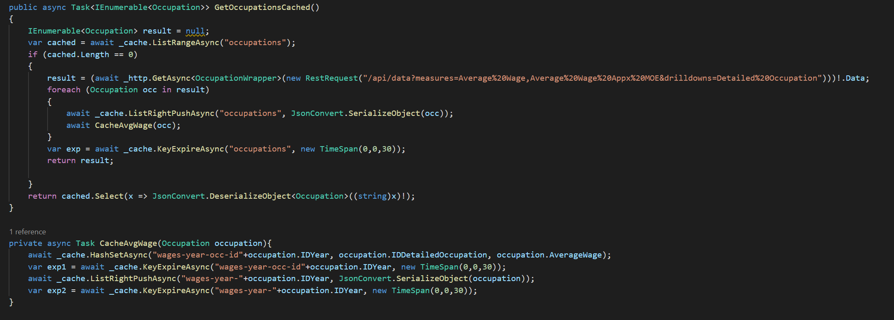
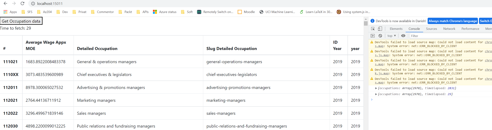

# Assignment 5 Redis

## Implementation
dotnet-core with Angular frontend and redis cache, all running as docker containers.

Redis is caching to a list with 30s TTL.
It is also caching more distinct versions with keys made up of year / occupation id and saving AVG wage, but this is not displayed in the frontend.

## How to run
Requires docker/ docker-compose
` docker-compose up -d `

Go to:
localhost:15011

- Press 'Get Occupation data' button

- Make note of 'Time to fetch'
- Press button again within 30 seconds and see the time to fetch having been reduced significantly due to caching.

- Wait more than 30 seconds and press the button again.
Now it should take a while to load again as the TTL has expired.
